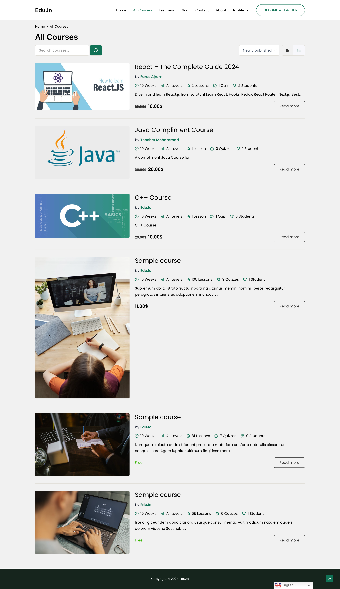
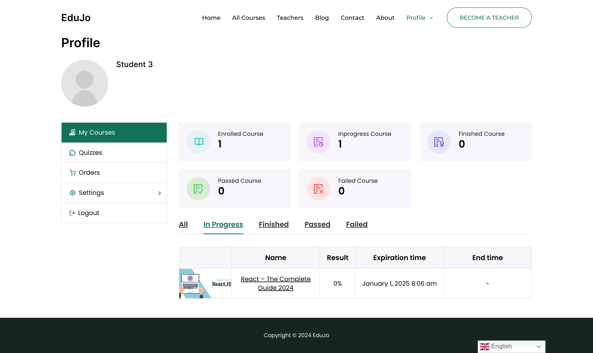

# EduJO - Online Learning Management System (LMS)

**EduJO** is a fully responsive Online Learning Management System built on WordPress. This platform simplifies course creation and management, enhances student engagement, and streamlines the educational workflow for instructors and students alike. EduJO integrates popular LMS plugins, like LifterLMS, to provide comprehensive functionality for managing courses, quizzes, and payments.

## Key Features

### User Registration
- Role-based registration for both students and instructors.

### Course Creation and Management
- Instructors can create and upload courses with multimedia content (videos, PDFs, etc.).

### Quiz Functionality and Progress Tracking
- Built-in quiz creation tools (multiple-choice, true/false).
- Automated tracking of student progress and course completion.
- Progress bars and certificates of completion.

### Payment Integration
- Integration with PayPal and Stripe for one-time or subscription-based payments.
- Flexible pricing options, including discounts and vouchers.

### Student and Instructor Dashboards
- Personalized dashboards for students (enrolled courses, progress, certificates).
- Instructor dashboards to manage courses, students, and quiz results.

### SEO and Marketing Tools
- Integration with Yoast SEO for optimizing course pages.

### Language Translation
- Support for multiple languages to cater to diverse users.

## Website Structure

- **Home Page**
- **Login/Register Page**
- **Courses Page**: Filter courses by categories, difficulty, and instructors. Includes search functionality.
- **Course Details Page**: Course description and enrollment option.
- **Checkout Page**: Integrated with WooCommerce for handling payments.
- **Cart Page**: View selected courses, apply coupons or discounts.
- **Instructor Profile Page**: Display bio, qualifications, and course list.
- **Instructor Dashboard**: Manage courses, students, and payments.
- **Student Dashboard**: Track course progress, quiz results, and certificates.
- **Quiz/Exam Page**: Take quizzes with instant results.
- **Contact Us Page**
- **About Us Page**

## Figma Design
Check out the full design prototype on Figma:
[Figma Design Link](https://www.figma.com/design/sHt6HEASl7fY4SZ7UJS7JO/Edu-JO?node-id=0-1&t=Ovpb5REo0HaFblUy-1)

## Project Screenshots

Here are some screenshots from the project:

1. **Home Page**
   

2. **Courses Page**
   

3. **Course Details Page**
   

4. **Course Lesson Details**
   

5. **Profile Page**

